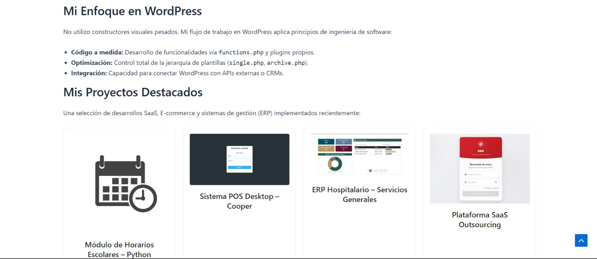

# Portafolio Personal - WordPress Child Theme

Este repositorio contiene el código fuente de mi portafolio personal, desarrollado como un **Tema Hijo (Child Theme)** de Astra.

## Características Técnicas
* **Sin constructores visuales:** Todo el diseño y funcionalidad se gestiona vía código.
* **Custom Post Type:** Implementación de CPT 'Proyectos' en `functions.php`.
* **Shortcode API:** Creación del shortcode `[mis_proyectos]` para renderizar la grilla dinámica.
* **Template Hierarchy:** Plantilla personalizada `single-proyecto.php` para el detalle de cada trabajo.

## Autor
Edgar Iván Gómez Barragán
